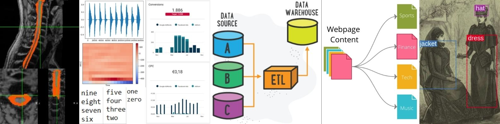
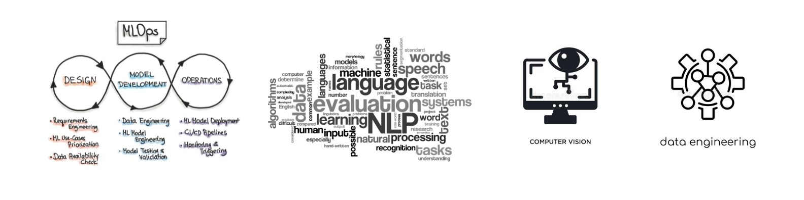

👋 Hi, I’m Koushik Vikram! I'm a Machine Learning Engineer, learning to productionize Machine Learning and Deep Learning models 🤖. I'm interested in MLOps and Multimodal Machine Learning Applications!

🖼️ Check out my [Projects](https://docs.google.com/presentation/d/1aHB9czcykSEpf9VcRZu8BxwK9RDxlAlg6rttus4cJEQ/edit#slide=id.gfc0a519646_0_130) and [Professional](https://docs.google.com/presentation/d/1xaMbOfVN_MTBk1qhSbi0HumXaNeqU6313tICI0Iv2qI/edit#slide=id.g1027d0b777f_0_124) Portfolios and click on the Pinner Repositories below! 

🤓 If you'd like to hire me or collaborate with me, 📫 reach me at koushikvikram91@gmail.com or on [LinkedIn](https://www.linkedin.com/in/koushikvikram/).

<!---
koushikvikram/koushikvikram is a ✨ special ✨ repository because its `README.md` (this file) appears on your GitHub profile.
You can click the Preview link to take a look at your changes.
--->
